# Phoenix LiveView + HeadlessUI

What a pair! They work together well using react + web components.

Also see the [https://blog.ftes.de/phoenix-liveview-headless-ui-b8a0291d4223](accompanying blog post).

```mermaid
sequenceDiagram
    participant L as 🦅 LiveView
    participant W as 📝 Web component
    participant R as ⚛️ React component
    participant U as 💁 User

    Note right of L: socket.assigns.value = "1"

    L->>W: <x-combobox value="1" />
    W->>W: connectedCallback()
    W->>R: <Combobox value="1" onSelect={...} />

    U->>R: Select value "2"
    R->>W: onSelect("2")
    W->>L: pushEvent("select", {value: "2"})

    Note right of L: socket.assigns.value = "2"

    L->>W: <x-combobox value="2" />
    W->>W: attributeChangedCallback()
    W->>R: <Combobox value="2" />
```

What works:
- react component `C` using HeadlessUI
- wrapped in a custom web component `W`, rendered in light DOM
- server -> client: watch HTML attribute changes in `W` via `observeAttributes` API
- client -> server: push LiveView events from `C` by exposing the LiveView `pushEvent` JS API using a minimal `PushHookEvent` hook

Abandoned approaches:
- render to shadow DOM ([no HeadlessUI support](https://github.com/tailwindlabs/headlessui/issues/835) -> glitches)
- [vue](https://github.com/ftes/phoenix-headlessui/tree/vue)
  - setup for SFCs (single file components) with minimalistic esbuild setup not worth the hassle
  - using Vue with JSX makes TailwindUI example code difficult to port
  - `defineCustomElement` web component wrapper does [not support rendering to light DOM](https://github.com/vuejs/core/issues/4314)
- [preact](https://github.com/ftes/phoenix-headlessui/tree/preact) (instead of react)
  - Components don't render -> didn't dig deeper

## Detailed diagram

```mermaid
sequenceDiagram
    participant L as 🦅 LiveView
    participant W as 📝 Web component
    participant R as ⚛️ React component
    participant U as 💁 User

    Note right of L: socket.assigns.value = "1"
    Note right of L: socket.assigns.options =<br/> [%{value: "1", label: "One"}, ...]

    L->>W: Init <br/> <x-combobox <br/> value="1"<br/>options="[{\"value\": \"1\", \"label\": \"One\"}]" <br/> />
    W->>W: connectedCallback(): Parse HTML attributes
    W->>R: render(<br/> <Combobox <br/> value="1" <br/> options={[{value: '1', label: 'One'}]} <br/> onSelect={...} <br/> />)
    Note left of R: state.open = false
    Note left of R: state.query = ""

    U->>R: Type query "Two"
    Note left of R: state.query = "Two"
    R->>R: Re-render filtered options dropdown
    U->>R: Select value "2"
    R->>W: onSelect("2")
    W->>L: pushEvent("select", {value: "2"})

    L->>L: handle_event("select", %{"value" => value}, _)
    Note right of L: socket.assigns.value = "2"

    L->>W: Update <br/> <x-combobox value="2" ... />
    W->>W: attributeChangedCallback(): parse HTML attributes
    W->>R: render(<Combobox value="2" ... />)
    R->>R: Re-render label
```

## Run the demo

To start your Phoenix server:

  * Install dependencies with `mix deps.get`
  * Start Phoenix endpoint with `mix phx.server` or inside IEx with `iex -S mix phx.server`

Now you can visit [`localhost:4000`](http://localhost:4000) from your browser.

Ready to run in production? Please [check our deployment guides](https://hexdocs.pm/phoenix/deployment.html).

## Learn more

  * Official website: https://www.phoenixframework.org/
  * Guides: https://hexdocs.pm/phoenix/overview.html
  * Docs: https://hexdocs.pm/phoenix
  * Forum: https://elixirforum.com/c/phoenix-forum
  * Source: https://github.com/phoenixframework/phoenix
